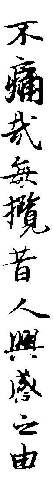

# Automatic image cutter

A Matlab program to cut text into columns from an image.

Written and tested on Matlab R2015a. **No backward compatibility has been taken into consideration. No guarantee it will run on any old version of Matlab. Go hell those who use pirated old Matlab 7.0 and tell me this program can't run on their machines.**

[Download Code](https://github.com/Jamesits/auto-image-cutter/releases)

[Fork me on Github](https://github.com/Jamesits/auto-image-cutter)

## Features

 * Highly configurable
 * Automatically detect binalization threshold based on lightness histogram
 * Draw figures to demonstrate every step of operation
 * Detailed comments and document

## Arguments

 * `image_path`:
    Source image path.
    * Should be a valid image file which format is supported by Matlab.

 * `output_filename_format`:
    Output image filename format.
    * Should be a valid format string.
    * Should contain one and only one `%d`.
    * **CAUTION: Any file with the same name will be OVERWRITTEN without warning!**
    * Default value:
    ```Matlab
    output_filename_format = [image_path, '.cut%03d.bmp'];
    ```
 * `left_bleed` and `right_bleed`:
    Cut the image wider slightly to avoid lose of some part of character which is far away from center.
    * Unit: pixel(s)
    * You can set left and right bleed individually.
    * Usually more extra width is needed on the right side.
    * Too big value may cause overlap of neighbor slices.
    * Default value:
    ```Matlab
    left_bleed = 8;
    right_bleed = 12;
    ```
 * `bw_threshold_detect_offset`:
    A bigger value will darken binarization result.
    * Value from 0 to 1
    * A bigger value makes the image looks better (strokes are more plump), but will bring bigger possibility of false positive result.
    * Default value:
    ```Matlab
    bw_threshold_detect_offset = 0.61803398874989484820458683436;
    ```
 * `blank_column_lightness_threshold`:
    A bigger value requires more blank (white) pixels in a column to be detected as a blank column.
    * Value from 0 to 1
    * A bigger value will result in wider cut result and sometimes too wide.
    * Default value:
    ```Matlab
    blank_column_lightness_threshold = 0.985211;
    ```
 * `run_length_encoding_minimal_distance`:
    The minimal distance of two character blocks which will not be treated as one block for being too near.
    * Unit: pixel(s)
    * A smaller value with a bigger `blank_column_lightness_threshold` will cause unwanted cuts.
    * A bigger value may cause two columns be cut in a single image.
    * Default value:
    ```Matlab
    run_length_encoding_minimal_distance = 10;
    ```
 * `reverse_image`:
    If set to true, color of the result image will be reversed (i.e. black -> white, white -> black).
    * Value: true or false
    * Default value:
    ```Matlab
    reverse_image = false;
    ```

## Example

There is an example to show the function of this program.

### Original Image

Image from: Zhejiang University Advanced Honor Class of Engineering Education Entrance Practice 2015, Module 2, Section 1, Problem A: "Image Division".


### Configure

```Matlab
left_bleed = 8;
right_bleed = 12;
bw_threshold_detect_offset = 0.61803398874989484820458683436;
blank_column_lightness_threshold = 0.985211;
run_length_encoding_minimal_distance = 10;
reverse_image = false;
```

### Result

Image 1



* * *

Image 2


* * *

Image 3


* * *

Image 4


* * *

Image 5


## License

Licensed under GPL 2.0. See [LICENSE](LICENSE) for full license text.

## Author

[James Swineson](http://swineson.me)

Contact me at jamesswineson[#]gmail.com.

## References

* [Run Length Encoding](http://ihoque.bol.ucla.edu/presentation.ppt) (MS PowerPoint 2003 Format)

## Thanks

 * [Matlab](https://www.mathworks.com/products/matlab/) by [Mathworks](https://www.mathworks.com)
 * Zhejiang University
 * Kejie Fu
 * Ziyi He
